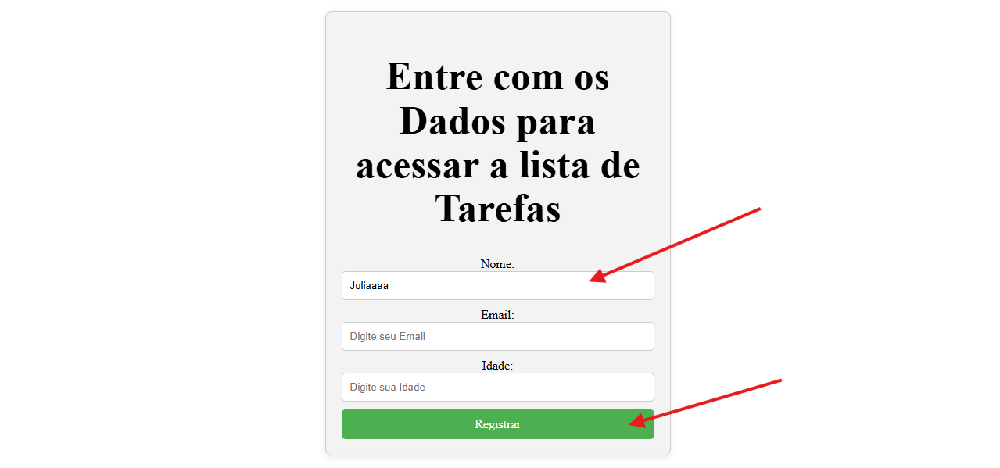
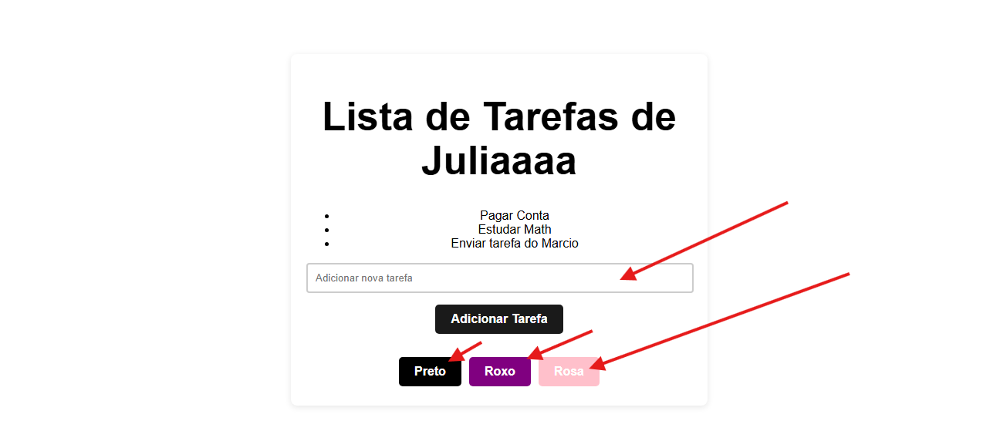

# React + Vite Project: Task Manager

Este projeto é construído usando React e Vite, apresentando um formulário para capturar informações do usuário e gerenciar uma lista de tarefas baseada no nome salvo no armazenamento local. O aplicativo permite que os usuários alterem dinamicamente a cor de fundo da página, proporcionando uma experiência de usuário personalizável.

Funcionalidades
Formulário de Informações do Usuário: Coleta detalhes do usuário e os salva no armazenamento local para personalizar a lista de tarefas.

Lista de Tarefas: Exibe tarefas associadas ao nome do usuário armazenado no armazenamento local.

Cor de Fundo Dinâmica: Os usuários podem alterar a cor de fundo da página por meio de uma interface simples.

Você pode ver melhor pelas imagens abaixo:

